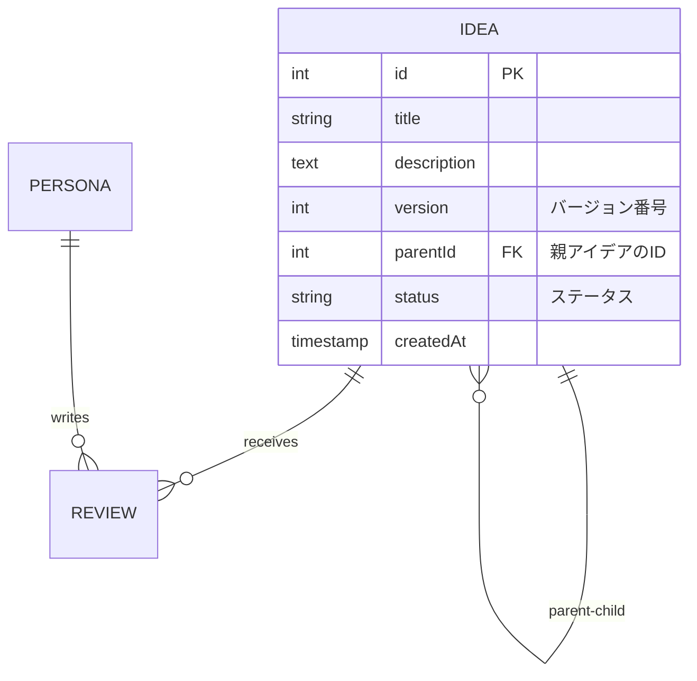

# PDCA サイクル機能

Market Mirrorでは、ビジネスアイデアを継続的に改善するためのPDCAサイクル機能を実装しています。

## 📋 概要

PDCAサイクルとは、「Plan（計画）→ Do（実行）→ Check（評価）→ Act（改善）」を繰り返すことで、継続的な改善を行う手法です。

Market Mirrorでは、このサイクルを**任意の回数**繰り返すことができます。

---

## 🔄 PDCAサイクルの流れ

### 1. **Plan（計画）** - アイデアの作成
トップページでビジネスアイデアを入力します。
- タイトル
- 詳細説明
- ターゲット層
- デッキ選択（Standard Japan / Inbound Tourist / Biz Tech）

### 2. **Do（実行）** - ペルソナによる評価
選択したデッキの10人のペルソナがアイデアを評価します。
- スコア（1-10）
- コメント
- 購入意向
- 改善提案

### 3. **Check（評価）** - レビュー結果の確認
レポートページで評価結果を確認します。
- 平均スコア
- 購入意向の割合
- ペルソナごとの詳細フィードバック
- 改善提案の一覧

### 4. **Act（改善）** - アイデアのブラッシュアップ
レビュー結果を元に、アイデアを改善します。
- 「改善版を作成」ボタンをクリック
- 改善提案を参考に内容を修正
- 新しいバージョンとして保存
- 再度評価を受ける

**→ 再び Plan に戻り、サイクルを継続**

---

## 🎯 主要機能

### 1. バージョン管理

各アイデアはバージョン管理されています：

| フィールド | 説明 |
|-----------|------|
| version | バージョン番号（1, 2, 3...） |
| parentId | 親アイデアのID（改善元） |
| status | ステータス（draft, improved） |

```typescript
// データベーススキーマ
model Idea {
  version  Int      @default(1)
  parentId Int?
  status   String   @default("draft")
  
  parent       Idea?  @relation("IdeaVersions", fields: [parentId], references: [id])
  improvements Idea[] @relation("IdeaVersions")
}
```

### 2. 改善版の作成

`/improve/[id]` ページで改善版を作成できます：

- **左側**: 元のアイデアと評価結果
  - 現在のタイトル・説明
  - 平均スコアと購入意向
  - ペルソナごとの改善提案

- **右側**: 改善版の入力フォーム
  - タイトルの編集
  - 説明の編集（改善提案を反映）
  - ターゲット層の調整

### 3. 履歴の可視化

レポートページに改善履歴が表示されます：

- **バージョンタイムライン**
  - v1 → v2 → v3 ... と視覚的に表示
  - 各バージョンのスコア改善を確認
  - クリックで各バージョンのレポートに移動

- **比較機能**
  - バージョン間のスコア差分
  - 購入意向の変化
  - 改善の効果を数値で確認

---

## 💾 データベース設計

### ERD（改善版）



### 自己参照リレーション

```sql
ALTER TABLE ideas 
ADD COLUMN version INTEGER DEFAULT 1,
ADD COLUMN parent_id INTEGER REFERENCES ideas(id) ON DELETE SET NULL,
ADD COLUMN status VARCHAR(50) DEFAULT 'draft';
```

**特徴:**
- 自己参照外部キー（parentId → id）
- カスケードは SET NULL（親削除時に子は残る）
- 無限にバージョンを作成可能

---

## 🚀 使用例

### 例1: スマホアプリのアイデア改善

#### v1（初版）
```
タイトル: 家計簿アプリ
説明: レシートを撮影して自動記録
平均スコア: 6.5
購入意向: 30%
主な改善提案: 
- もっと具体的な機能説明が欲しい
- 他アプリとの差別化が不明確
- 価格設定が不明
```

#### v2（改善版）
```
タイトル: AI家計簿「スマート・マネー」
説明: 
- レシート撮影で自動記録
- AIが支出傾向を分析
- 節約目標の自動提案
- 銀行口座との連携
- 無料プラン + プレミアム月額500円

平均スコア: 8.2 (+1.7) ⬆️
購入意向: 60% (+30%) ⬆️
```

#### v3（さらに改善）
```
(さらに改善提案を反映...)
平均スコア: 8.9 (+0.7) ⬆️
購入意向: 75% (+15%) ⬆️
```

---

## 📊 統計情報

### バージョン間の改善効果

```typescript
// Server Action: compareVersions
const comparison = await compareVersions(v1Id, v2Id);

// 結果
{
  improvement: {
    scoreDiff: +1.7,      // スコア改善
    buyDiff: +30,         // 購入意向改善率
  }
}
```

### 履歴の取得

```typescript
// Server Action: getIdeaHistory
const history = await getIdeaHistory(ideaId);

// 結果
{
  currentVersion: 3,
  totalVersions: 3,
  versions: [
    { version: 1, avgScore: 6.5, buyPercentage: 30 },
    { version: 2, avgScore: 8.2, buyPercentage: 60 },
    { version: 3, avgScore: 8.9, buyPercentage: 75 },
  ]
}
```

---

## 🔧 技術的な実装

### Server Actions

#### 1. 改善版の作成

```typescript
export async function createImprovedIdea(
  originalIdeaId: number,
  improvements: {
    title: string;
    description: string;
    targetAudience: string;
  }
) {
  return await prisma.$transaction(async (tx) => {
    // 元のアイデアを「改善済み」に更新
    await tx.idea.update({
      where: { id: originalIdeaId },
      data: { status: 'improved' }
    });
    
    // 新バージョンを作成
    const improved = await tx.idea.create({
      data: {
        ...improvements,
        version: original.version + 1,
        parentId: originalIdeaId,
        status: 'draft',
      }
    });
    
    return improved;
  });
}
```

#### 2. 履歴の取得（再帰）

```typescript
const getAllVersions = async (currentId: number): Promise<Idea[]> => {
  const current = await prisma.idea.findUnique({
    where: { id: currentId },
    include: { improvements: true }
  });
  
  const children = await Promise.all(
    current.improvements.map(child => getAllVersions(child.id))
  );
  
  return [current, ...children.flat()];
};
```

---

## 🎓 学習ポイント（データベース授業向け）

### 1. 自己参照リレーション
- テーブルが自分自身を参照
- 階層構造やバージョン管理に使用
- 再帰クエリの実装

### 2. トランザクション処理
- 複数の更新を1つの処理として実行
- 親の更新と子の作成を同時に行う
- エラー時のロールバック

### 3. 再帰的データ取得
- 親→子→孫...と再帰的に取得
- ツリー構造の探索
- パフォーマンスへの配慮

### 4. ビジネスロジックの実装
- ステータス管理（draft, improved）
- バージョン番号の自動採番
- 履歴の追跡

---

## 📈 拡張案

### 今後実装できる機能

1. **バージョン比較ビュー**
   - 2つのバージョンを並べて表示
   - 差分を視覚的にハイライト
   - 改善ポイントの明確化

2. **分岐管理**
   - 1つのアイデアから複数の改善案
   - A/Bテスト的な評価
   - ベストバージョンの選択

3. **コメント機能**
   - バージョンごとにメモを残す
   - 改善の意図を記録
   - チームでの共有

4. **エクスポート機能**
   - 改善履歴をPDFで出力
   - プレゼンテーション資料に活用
   - 投資家への説明資料

---

## 🎯 まとめ

PDCAサイクル機能により：

1. ✅ **継続的改善** - アイデアを何度でも磨き上げられる
2. ✅ **効果測定** - 改善の効果を数値で確認できる
3. ✅ **履歴管理** - 過去のバージョンを振り返れる
4. ✅ **学習機会** - フィードバックから学べる

**→ より良いビジネスアイデアを生み出すための強力なツール**

---

作成日: 2025-12-19
