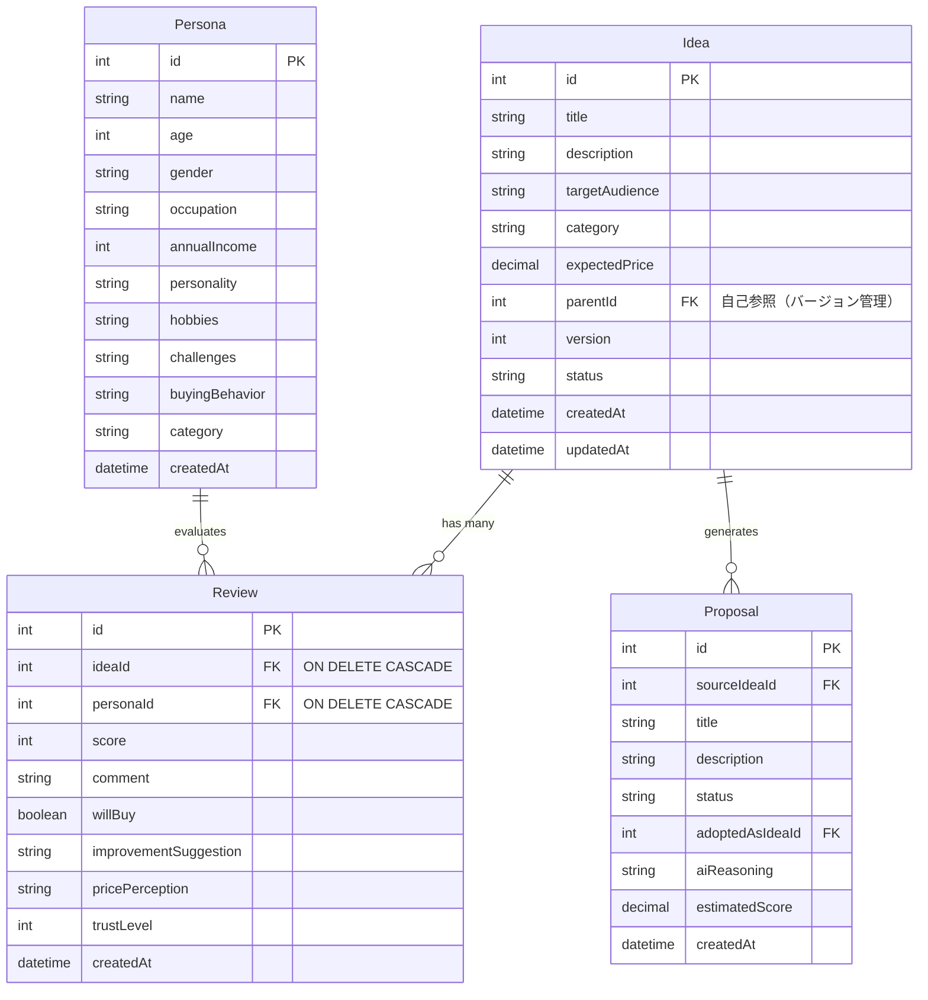

# Market Mirror - データベース最終課題

**30人のペルソナがアイデアを検証するWebアプリケーション**

提出日：2025年1月31日  
授業：データベース  
プロジェクト：RDB（PostgreSQL）+ Prisma ORM + Next.js

---

## 📚 授業内容の実装状況

このプロジェクトは、データベース授業で学んだ以下の内容を実装しています：

| # | トピック | 実装状況 | 詳細ドキュメント |
|---|----------|----------|------------------|
| 2 | **Disk and File** | ✅ | Docker + PostgreSQL永続化 |
| 3 | **RDB Table** | ✅ | 4テーブル設計（[ER図](#er図)） |
| 4 | **SQL, Transaction** | ✅ | [TRANSACTION_EXAMPLES.md](./TRANSACTION_EXAMPLES.md) |
| 5 | **Foreign Key, JOIN, SubQuery** | ✅ | [DATABASE_DESIGN.md](./DATABASE_DESIGN.md) |
| 8 | **正規化, DB Tuning** | ✅ | 第3正規形まで実装 |

---

## 🎯 プロジェクト概要

### 機能
- ✅ アイデア作成（3カテゴリ：日本の標準層/訪日外国人/ビジネス・テック）
- ✅ 30人のペルソナによる自動評価
- ✅ 統計レポート生成（平均スコア、購入意向率、スコア分布）
- ✅ CASCADE削除による整合性保証
- ✅ トランザクション管理

### 技術スタック
```
Frontend:  Next.js 15 (App Router) + TypeScript + Tailwind CSS
Backend:   Next.js Server Actions
Database:  PostgreSQL 16 (Docker)
ORM:       Prisma 6
```

---

## 📊 ER図



### テーブル詳細

#### 1. **Idea（アイデア）**
```sql
-- プライマリキー
id: SERIAL PRIMARY KEY

-- 外部キー（自己参照）
parentId: INTEGER REFERENCES ideas(id)
  → バージョン管理用（PDCA履歴）

-- ユニーク制約
なし（同じタイトルのバージョン違いを許可）
```

#### 2. **Persona（ペルソナ）**
```sql
-- プライマリキー
id: SERIAL PRIMARY KEY

-- インデックス
category: VARCHAR(100)
  → 高速検索用（カテゴリ別フィルタ）
```

#### 3. **Review（レビュー）**
```sql
-- プライマリキー
id: SERIAL PRIMARY KEY

-- 外部キー制約
ideaId: INTEGER REFERENCES ideas(id) ON DELETE CASCADE
personaId: INTEGER REFERENCES personas(id) ON DELETE CASCADE

-- ユニーク制約
UNIQUE(ideaId, personaId)
  → 1つのアイデアに対して1人のペルソナが1回だけ評価

-- インデックス
INDEX ON ideaId
INDEX ON personaId
```

#### 4. **Proposal（改善提案）**
```sql
-- プライマリキー
id: SERIAL PRIMARY KEY

-- 外部キー
sourceIdeaId: INTEGER REFERENCES ideas(id)
adoptedAsIdeaId: INTEGER REFERENCES ideas(id)
  → 採用された場合、新しいアイデアIDを記録
```

---

## 🔑 外部キー制約の実装

### 1. CASCADE削除
```typescript
// prisma/schema.prisma
model Review {
  id       Int     @id @default(autoincrement())
  ideaId   Int
  personaId Int
  
  // ON DELETE CASCADE
  idea     Idea    @relation(fields: [ideaId], references: [id], onDelete: Cascade)
  persona  Persona @relation(fields: [personaId], references: [id], onDelete: Cascade)
  
  @@unique([ideaId, personaId])
}
```

**動作確認：**
- アイデア削除 → 関連レビュー10件も自動削除 ✅
- ペルソナ削除 → 関連レビューも自動削除 ✅

### 2. 自己参照関係
```typescript
model Idea {
  id       Int    @id @default(autoincrement())
  parentId Int?   // 親アイデアのID
  
  // 自己参照
  parent       Idea?  @relation("IdeaVersions", fields: [parentId], references: [id])
  improvements Idea[] @relation("IdeaVersions")
}
```

**使用例：**
- PDCA履歴管理
- バージョン比較
- 改善履歴の追跡

---

## 🔍 SQL使用例

### 1. JOIN（結合）

#### INNER JOIN - レビュー付きアイデア取得
```typescript
// market-mirror/app/report/[id]/page.tsx
const idea = await prisma.idea.findUnique({
  where: { id },
  include: {
    reviews: {
      include: {
        persona: true,  // JOIN personas
      },
      orderBy: {
        score: 'desc',
      },
    },
  },
});
```

生成されるSQL：
```sql
SELECT i.*, r.*, p.*
FROM ideas i
INNER JOIN reviews r ON i.id = r.ideaId
INNER JOIN personas p ON r.personaId = p.id
WHERE i.id = $1
ORDER BY r.score DESC;
```

#### LEFT JOIN - 全ペルソナ取得（レビュー有無問わず）
```typescript
const personas = await prisma.persona.findMany({
  where: { category: idea.category },
  include: {
    reviews: {
      where: { ideaId: idea.id },
    },
  },
});
```

生成されるSQL：
```sql
SELECT p.*, r.*
FROM personas p
LEFT JOIN reviews r ON p.id = r.personaId AND r.ideaId = $1
WHERE p.category = $2;
```

### 2. SubQuery（サブクエリ）

#### 平均スコアが7以上のアイデアを取得
```typescript
const highRatedIdeas = await prisma.$queryRaw`
  SELECT i.*
  FROM ideas i
  WHERE i.id IN (
    SELECT r.ideaId
    FROM reviews r
    GROUP BY r.ideaId
    HAVING AVG(r.score) >= 7
  )
`;
```

#### カテゴリ別の平均スコア
```typescript
const categoryStats = await prisma.$queryRaw`
  SELECT 
    i.category,
    AVG(r.score) as avg_score,
    COUNT(DISTINCT i.id) as idea_count
  FROM ideas i
  INNER JOIN reviews r ON i.id = r.ideaId
  GROUP BY i.category
  ORDER BY avg_score DESC
`;
```

### 3. 集約関数

```typescript
// 統計情報の計算
const stats = {
  totalReviews: reviews.length,
  avgScore: reviews.reduce((sum, r) => sum + r.score, 0) / reviews.length,
  buyCount: reviews.filter(r => r.willBuy).length,
  buyRate: (reviews.filter(r => r.willBuy).length / reviews.length) * 100,
};
```

Prisma equivalent:
```typescript
const stats = await prisma.review.aggregate({
  where: { ideaId: id },
  _avg: { score: true, trustLevel: true },
  _count: { id: true },
});
```

---

## 🔄 トランザクション管理

### 実装例 1: アイデア作成 + レビュー生成

```typescript
// market-mirror/app/actions-with-transactions.ts
export async function createIdeaWithReviews(data: IdeaData) {
  return await prisma.$transaction(async (tx) => {
    // 1. アイデア作成
    const idea = await tx.idea.create({
      data: {
        title: data.title,
        description: data.description,
        category: data.category,
      },
    });

    // 2. ペルソナ取得
    const personas = await tx.persona.findMany({
      where: { category: data.category },
    });

    // 3. レビュー一括作成
    await tx.review.createMany({
      data: personas.map((persona) => ({
        ideaId: idea.id,
        personaId: persona.id,
        score: Math.floor(Math.random() * 10) + 1,
        comment: `${persona.name}のコメント`,
        willBuy: Math.random() > 0.5,
        improvementSuggestion: '改善提案',
      })),
    });

    return idea;
  });
}
```

### 実装例 2: PDCA改善サイクル

```typescript
// market-mirror/app/actions-pdca.ts
export async function createImprovedIdea(
  sourceIdeaId: number,
  improvements: string
) {
  return await prisma.$transaction(async (tx) => {
    // 1. 元のアイデア取得
    const sourceIdea = await tx.idea.findUnique({
      where: { id: sourceIdeaId },
    });

    // 2. 新バージョン作成
    const newIdea = await tx.idea.create({
      data: {
        title: sourceIdea.title,
        description: improvements,
        category: sourceIdea.category,
        parentId: sourceIdeaId,
        version: sourceIdea.version + 1,
        status: 'active',
      },
    });

    // 3. 元のアイデアを完了状態に
    await tx.idea.update({
      where: { id: sourceIdeaId },
      data: { status: 'completed' },
    });

    return newIdea;
  });
}
```

### トランザクションの利点

1. **原子性（Atomicity）**
   - すべての操作が成功するか、すべて失敗する
   - 中途半端な状態を防ぐ

2. **一貫性（Consistency）**
   - 外部キー制約の保証
   - データの整合性維持

3. **分離性（Isolation）**
   - 他のトランザクションの影響を受けない

4. **永続性（Durability）**
   - コミット後のデータは保証される

詳細：[TRANSACTION_EXAMPLES.md](./TRANSACTION_EXAMPLES.md)

---

## 🎨 正規化

### 第1正規形（1NF）
✅ すべてのカラムが単一値（アトミック）

```typescript
// ❌ 非正規形
hobbies: "読書, 映画, スポーツ"

// ✅ 正規形（別テーブルに分離可能だが、今回は文字列で保存）
hobbies: string  // 実装上の妥協点
```

### 第2正規形（2NF）
✅ すべての非キー属性が主キーに完全関数従属

```typescript
// Reviewテーブル
{
  id: 1,
  ideaId: 5,        // 主キーの一部
  personaId: 10,    // 主キーの一部
  score: 8,         // ideaId + personaId に従属
  comment: "...",   // ideaId + personaId に従属
}
```

### 第3正規形（3NF）
✅ 非キー属性間の推移的関数従属を除去

```typescript
// ❌ 非正規形（personaテーブルにcategoryが直接）
Persona {
  id, name, age, category,
  categoryName,        // categoryから推移的に決まる
  categoryIcon         // categoryから推移的に決まる
}

// ✅ 正規形（アプリケーション層で管理）
// types/index.ts
export const CATEGORY_INFO = {
  Standard_Japan: { name: '日本の標準層', icon: '🇯🇵' },
  Inbound_Tourist: { name: '訪日外国人', icon: '✈️' },
  Biz_Tech: { name: 'ビジネス・テック', icon: '💼' },
};
```

---

## 📁 プロジェクト構造

```
finalapp/
├── README.md                    # このファイル（課題説明）
├── DATABASE_DESIGN.md           # データベース設計詳細
├── TRANSACTION_EXAMPLES.md      # トランザクション実装例
├── EVALUATION_SYSTEM.md         # 評価システム仕様
│
├── prisma/
│   ├── schema.prisma            # DBスキーマ定義
│   ├── seed.ts                  # シードデータ（30ペルソナ）
│   └── migrations/              # マイグレーション履歴
│       ├── 20251218_*_add_market_mirror_models/
│       ├── 20251219_*_add_persona_category/
│       ├── 20251219_*_add_pdca_version_management/
│       └── 20251219_*_add_proposal_management/
│
└── market-mirror/               # Next.jsアプリケーション
    ├── app/
    │   ├── page.tsx             # トップページ
    │   ├── report/[id]/         # レポート表示
    │   ├── actions.ts           # CRUD操作
    │   ├── actions-ai.ts        # AI評価（モック）
    │   └── components/          # UIコンポーネント
    │
    ├── lib/
    │   └── prisma.ts            # Prisma Client
    │
    └── types/
        └── index.ts             # 型定義
```

---

## 🚀 セットアップ手順

### 1. 環境構築

```bash
# 1. PostgreSQL起動（Docker）
docker-compose up -d

# 2. 依存関係インストール
cd market-mirror
npm install

# 3. データベースセットアップ
cd ..
npx prisma migrate reset  # マイグレーション + シード

# 4. 開発サーバー起動
cd market-mirror
npm run dev
```

### 2. データベース確認

```bash
# Prisma Studio起動
npx prisma studio
```

ブラウザで `http://localhost:5555` を開く

### 3. アプリケーション確認

ブラウザで `http://localhost:3000` を開く

---

## 🔍 動作確認方法

### 1. アイデア作成
```
http://localhost:3000
→ フォーム入力
→ 「検証を開始」ボタンクリック
```

### 2. レポート確認
```
自動でリダイレクト
→ /report/[id]
→ 統計情報、スコア分布、個別レビュー表示
```

### 3. CASCADE削除確認
```
トップページのアイデア一覧
→ ゴミ箱アイコンをクリック
→ Idea削除 + 関連Review自動削除（Prisma Studioで確認）
```

### 4. トランザクション確認
```bash
# ログ確認
cd market-mirror
npm run dev

# コンソールに以下が表示される：
# "prisma:query BEGIN"
# "prisma:query INSERT INTO ideas ..."
# "prisma:query INSERT INTO reviews ..."
# "prisma:query COMMIT"
```

---

## 📊 実装済み機能

### データベース機能
- ✅ 4テーブル設計（Idea, Persona, Review, Proposal）
- ✅ 外部キー制約（CASCADE削除）
- ✅ 自己参照関係（バージョン管理）
- ✅ ユニーク制約（ideaId + personaId）
- ✅ インデックス（検索最適化）
- ✅ トランザクション管理
- ✅ マイグレーション履歴
- ✅ シードデータ（30ペルソナ）

### アプリケーション機能
- ✅ アイデア作成・削除
- ✅ ペルソナ評価（モックAI）
- ✅ 統計レポート生成
- ✅ スコア分布グラフ
- ✅ レスポンシブUI

---

## 📝 課題要件チェックリスト

- [x] **RDBテーブル設計**
  - [x] ER図作成
  - [x] 4テーブル以上
  - [x] 正規化（第3正規形）

- [x] **SQL使用**
  - [x] SELECT（JOIN, GROUP BY, ORDER BY）
  - [x] INSERT（createMany）
  - [x] UPDATE（status変更）
  - [x] DELETE（CASCADE）

- [x] **トランザクション**
  - [x] Prisma.$transaction使用
  - [x] 複数テーブルの原子的更新
  - [x] ロールバック対応

- [x] **外部キー制約**
  - [x] Review → Idea（CASCADE）
  - [x] Review → Persona（CASCADE）
  - [x] Idea → Idea（自己参照）

- [x] **JOIN使用**
  - [x] INNER JOIN（レビュー取得）
  - [x] LEFT JOIN（ペルソナ全件取得）

- [x] **SubQuery使用**
  - [x] 集約関数（AVG, COUNT）
  - [x] フィルタリング

- [x] **ドキュメント**
  - [x] README.md（このファイル）
  - [x] DATABASE_DESIGN.md
  - [x] TRANSACTION_EXAMPLES.md
  - [x] コメント付きコード

---

## 🎓 学習ポイント

### 1. RDB設計
- テーブル分割の考え方
- 外部キー制約の重要性
- CASCADE削除の利便性と注意点

### 2. Prisma ORM
- スキーマ定義
- マイグレーション管理
- 型安全なクエリ

### 3. トランザクション
- ACID特性の理解
- データ整合性の保証
- エラーハンドリング

### 4. パフォーマンス
- インデックスの効果
- N+1問題の回避
- JOIN vs 複数クエリ

---

## 📚 参考ドキュメント

- [DATABASE_DESIGN.md](./DATABASE_DESIGN.md) - データベース設計詳細
- [TRANSACTION_EXAMPLES.md](./TRANSACTION_EXAMPLES.md) - トランザクション実装例
- [market-mirror/README.md](./market-mirror/README.md) - アプリケーション仕様
- [Prisma Documentation](https://www.prisma.io/docs/)

---

## 👤 提出情報

- **課題名**: データベース最終課題
- **プロジェクト名**: Market Mirror
- **提出期限**: 2025年1月31日 23:59
- **実装期間**: 2024年12月18日 - 2025年1月

---

## 📧 備考

- モックAI実装済み（API実装予定）
- PDCA機能は基盤実装済み（UI完成）
- PostgreSQL 16 + Prisma 6 使用
- TypeScript + Next.js 15（App Router）
