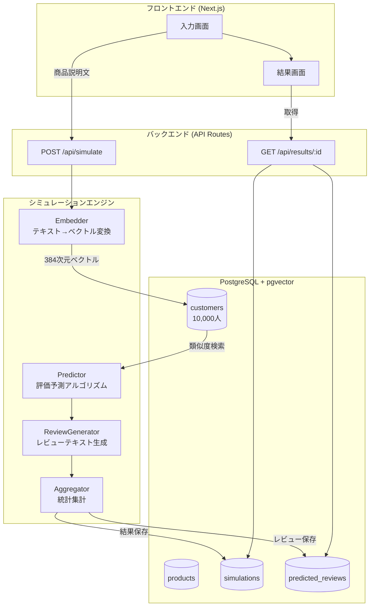
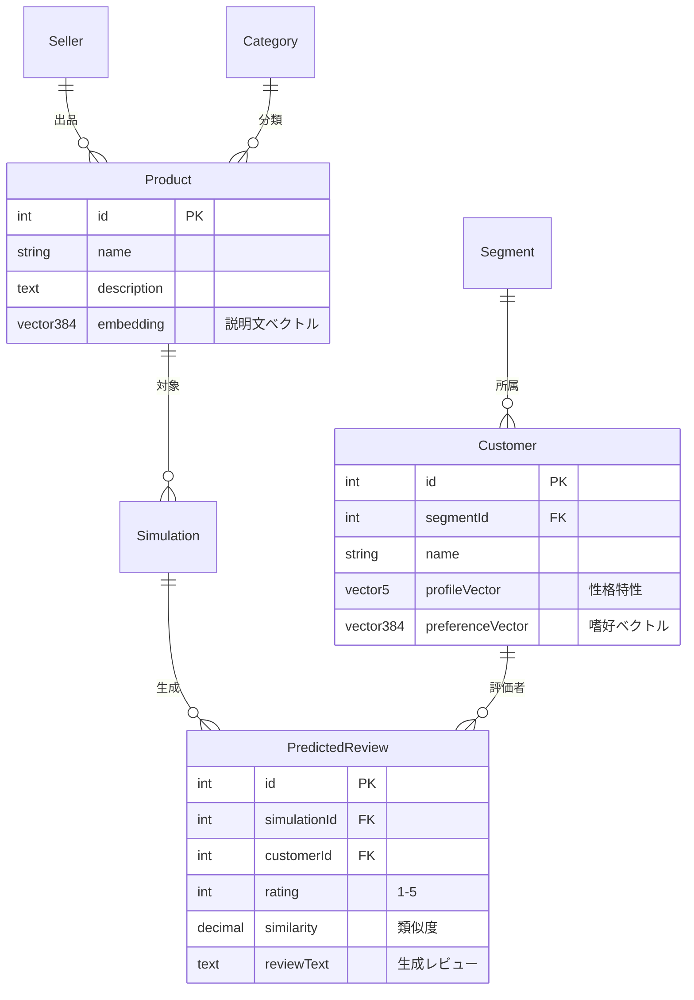

# Review Predictor 🎯

> 新商品の説明文から、10,000人の仮想顧客がどう評価するかを予測するシミュレーションツール

---

## チーム情報

| 項目 | 内容 |
|------|------|
| **チーム名** | おでん |
| **授業名** | データベース 最終課題 |

### メンバー

| 学籍番号 | 氏名 |
|---------|------|
| 2442001 | 赤塩甫 |
| 2442003 | 阿部純太 |
| 2442040 | シャリフ大睦 |
| 2442071 | 服田愛樹 |

---

## デモ

### システム概要図


*※ 画像がない場合は下記のMermaid図を参照*

### デモ動画

https://github.com/user-attachments/assets/（ここに動画IDを貼り付け）

*※ 動画をアップロード後、URLを貼り付けてください*

---

## 👤 ターゲットユーザー（ペルソナ）

### ペルソナ1: 田中 美咲（32歳）- EC出品者

| 項目 | 内容 |
|------|------|
| **職業** | ハンドメイドアクセサリー作家 |
| **ECサイト** | minne, Creema で販売中 |
| **悩み** | 新作を出しても最初のレビューがつくまで売れない。説明文をどう書けば響くかわからない |
| **ITスキル** | スマホは得意、PCは苦手 |
| **利用シーン** | 新作発表前に「この説明文で大丈夫？」と確認したい |

**このアプリで解決できること:**
- 出品前に顧客の反応を予測
- セグメント別分析で「品質重視層には響くが、価格重視層には厳しい」などの気づきを得る
- 説明文を改善するヒントを得る

---

### ペルソナ2: 鈴木 健太（28歳）- スタートアップのマーケター

| 項目 | 内容 |
|------|------|
| **職業** | D2Cブランドのマーケティング担当 |
| **担当** | 自社ECサイトの商品ページ最適化 |
| **悩み** | A/Bテストに時間がかかる。事前に反応を予測してから本番テストしたい |
| **ITスキル** | 高い。データ分析ツールも使いこなす |
| **利用シーン** | 商品ページのリニューアル時に複数案を比較評価 |

**このアプリで解決できること:**
- 複数の説明文案を素早く比較
- データに基づいた意思決定
- マーケティング施策の事前検証

---

### ペルソナ3: 山田 太郎（45歳）- 中小企業の商品企画部長

| 項目 | 内容 |
|------|------|
| **職業** | 生活雑貨メーカーの商品企画部長 |
| **担当** | 新商品の企画・販売戦略 |
| **悩み** | 社内プレゼンで「この商品は売れるのか？」と聞かれても根拠を示せない |
| **ITスキル** | Excel程度。新しいツールには慎重 |
| **利用シーン** | 企画会議前に市場の反応を予測し、資料に添える |

**このアプリで解決できること:**
- 予測評価を企画書のエビデンスとして活用
- 「品質重視層からの評価が高い」など、具体的なターゲット提案ができる
- 直感ではなくデータで説得

---

## 📖 プロジェクトの背景

### 解決したい課題

ECサイトで新商品を出品する際、**「この商品は売れるのか？」** という不安があります。

- レビューがない新商品は購入されにくい
- 実際に売り出すまで顧客の反応がわからない
- 商品説明文の書き方で売上が大きく変わる

### 本システムのアプローチ

**「売る前に、顧客の反応を予測できたら？」**

本システムは、10,000人の仮想顧客プロファイルを事前にデータベースに格納し、商品説明文との**ベクトル類似度**を計算することで、各顧客がどのような評価（★1〜5）をつけるかを予測します。

```
商品説明文 → ベクトル化 → 10,000人との類似度計算 → 評価予測 → 統計表示
```

これにより、出品前に「この商品説明文でターゲット層に響くか？」を確認できます。

---

## 🖥️ システムの画面フロー

### 1. 入力画面（/input）

```
┌─────────────────────────────────────────────────────────────┐
│  Review Predictor                                           │
├─────────────────────────────────────────────────────────────┤
│                                                             │
│  📝 商品説明を入力                                          │
│  ┌─────────────────────────────────────────────────────┐   │
│  │                                                     │   │
│  │  高級イタリアンレザーを使用した職人手作りの財布。   │   │
│  │  10年使える耐久性と、使い込むほど味が出る経年変化   │   │
│  │  が特徴です。                                       │   │
│  │                                                     │   │
│  └─────────────────────────────────────────────────────┘   │
│                                           [シミュレーション実行]  │
│                                                             │
│  📜 最近のシミュレーション                                  │
│  ├─ 2024/01/14 スマートウォッチ... ★4.2                   │
│  ├─ 2024/01/13 オーガニック化粧品... ★3.8                 │
│  └─ 2024/01/12 ワイヤレスイヤホン... ★4.5                 │
│                                                             │
└─────────────────────────────────────────────────────────────┘
```

**機能:**
- 商品説明文の入力（10文字以上必須）
- リアルタイム文字数カウント
- 過去5件のシミュレーション履歴表示

---

### 2. 結果画面（/result/[id]）

```
┌─────────────────────────────────────────────────────────────┐
│  シミュレーション結果                                       │
├─────────────────────────────────────────────────────────────┤
│                                                             │
│  ┌──────────┐ ┌──────────┐ ┌──────────┐                    │
│  │ 平均評価 │ │ 購入率   │ │ 総レビュー │                   │
│  │  ★4.2   │ │  68.5%  │ │  10,000  │                    │
│  └──────────┘ └──────────┘ └──────────┘                    │
│                                                             │
│  📊 評価分布                                                │
│  ★5 ████████████████████ 35%                               │
│  ★4 ██████████████████████████ 45%                         │
│  ★3 ██████ 12%                                             │
│  ★2 ██ 5%                                                  │
│  ★1 █ 3%                                                   │
│                                                             │
│  👥 セグメント別分析                                        │
│  ┌─────────────────────────────────────────────────────┐   │
│  │ セグメント      │ 平均評価 │ 人数  │ 特徴          │   │
│  ├─────────────────────────────────────────────────────┤   │
│  │ 品質重視層      │  ★4.8   │ 2,500 │ 高評価傾向    │   │
│  │ ブランド志向層  │  ★4.5   │ 2,500 │ やや高評価    │   │
│  │ デザイン重視層  │  ★4.0   │ 2,500 │ 中立的        │   │
│  │ 価格重視層      │  ★3.2   │ 2,500 │ 厳しめ評価    │   │
│  └─────────────────────────────────────────────────────┘   │
│                                                             │
│  💬 サンプルレビュー                                        │
│  ┌─────────────────────────────────────────────────────┐   │
│  │ ★★★★★ (類似度: 0.92)                                 │   │
│  │ 「素晴らしい品質です！期待以上でした。」             │   │
│  ├─────────────────────────────────────────────────────┤   │
│  │ ★★★☆☆ (類似度: 0.45)                                 │   │
│  │ 「普通かな。価格の割には...」                        │   │
│  └─────────────────────────────────────────────────────┘   │
│                                                             │
└─────────────────────────────────────────────────────────────┘
```

**機能:**
- 平均評価・購入率（★4以上の割合）・総レビュー数
- 評価分布の棒グラフ
- 4つの顧客セグメント別分析
- 実際に生成されたサンプルレビューの表示

---

## 🔧 システムアーキテクチャ



---

## 💡 技術的なポイント

### 1. ベクトル類似度検索（pgvector + HNSW）

```sql
-- 10,000人の顧客から類似度の高い順に取得
SELECT
    c.id,
    c.name,
    1 - (c."preferenceVector" <=> $1::vector) as similarity
FROM customers c
ORDER BY c."preferenceVector" <=> $1::vector
```

- **HNSWインデックス**: O(n) → O(log n) の高速化
- **コサイン類似度**: テキストの意味的な近さを測定

### 2. 評価予測アルゴリズム

```typescript
// 類似度とセグメント特性から評価を予測
let score = similarity * 5;  // 基本スコア

if (segment === 'Quality Focused' && similarity > 0.7) {
    score += 0.8;  // 品質重視層は高類似度で高評価
}
if (segment === 'Price Sensitive' && similarity < 0.6) {
    score -= 0.5;  // 価格重視層は低類似度で厳しめ
}
// ... その他の調整

return Math.round(clamp(score, 1, 5));
```

### 3. トランザクション処理

```typescript
// 商品作成→シミュレーション作成→レビュー10,000件挿入を一括で
await prisma.$transaction(async (tx) => {
    const product = await tx.product.create({ ... });
    const simulation = await tx.simulation.create({ ... });

    // バッチ挿入（1,000件ずつ）
    for (const batch of chunks(reviews, 1000)) {
        await tx.$executeRaw`INSERT INTO predicted_reviews ...`;
    }
});
```

---

## 📊 データベース設計

### ER図



### テーブル一覧（7テーブル・第3正規形）

| テーブル | 役割 | レコード数 |
|---------|------|-----------|
| sellers | 出品者情報 | 1 |
| categories | 商品カテゴリ | 5 |
| products | 商品（ベクトル付き） | シミュレーション数 |
| segments | 顧客セグメント | 4 |
| customers | 仮想顧客プロファイル | **10,000** |
| simulations | シミュレーション実行記録 | 実行数 |
| predicted_reviews | 予測レビュー | シミュレーション数 × 10,000 |

---

## 🎓 データベース授業要件への対応

| 授業回 | テーマ | 本システムでの実装 |
|--------|--------|-------------------|
| #2 | Disk and File | pgvectorのHNSWインデックス（階層的グラフ構造） |
| #3 | RDB Table | 7テーブルの正規化設計 |
| #4 | SQL, Transaction | シミュレーション実行のACID保証 |
| #5 | FK, JOIN, SubQuery | セグメント別集計の複合クエリ |
| #8 | 正規化, DB Tuning | 第3正規形 + EXPLAIN ANALYZEによる最適化 |
| #10 | 分散DB | Read Replicaアーキテクチャの設計 |
| #11 | Vector DB | **pgvectorによるベクトル類似度検索** |

---

## 🚀 セットアップ

### 前提条件

- Node.js 20.x以上
- PostgreSQL 15.x以上（pgvector拡張必須）
- Docker（推奨）

### クイックスタート

```bash
# 1. 依存パッケージのインストール
npm install

# 2. PostgreSQL + pgvectorの起動（Docker）
docker-compose up -d

# 3. データベースマイグレーション
npx prisma migrate dev

# 4. 10,000人の顧客データを生成
npx prisma db seed

# 5. 開発サーバー起動
npm run dev
```

### 動作確認

1. http://localhost:3000/input にアクセス
2. 以下のサンプル説明文を入力:
   ```
   高級イタリアンレザーを使用した職人手作りの財布。
   10年使える耐久性と、使い込むほど味が出る経年変化が特徴。
   ```
3. 「シミュレーション実行」をクリック
4. 結果画面で予測評価を確認

---

## 📁 プロジェクト構造

```
src/
├── app/
│   ├── input/page.tsx        # 入力画面
│   ├── result/[simulationId]/page.tsx  # 結果画面
│   └── api/
│       ├── simulate/route.ts # シミュレーション実行API
│       └── results/[simulationId]/route.ts  # 結果取得API
├── features/
│   └── simulation/
│       └── engine/
│           ├── embedder.ts   # ベクトル変換
│           ├── predictor.ts  # 評価予測
│           ├── reviewGenerator.ts  # レビュー生成
│           └── aggregator.ts # 統計集計
└── lib/
    └── prisma.ts             # DBクライアント

prisma/
├── schema.prisma             # スキーマ定義
└── seed.ts                   # 10,000人の顧客生成
```

---

## 📚 ドキュメント

| ドキュメント | 内容 |
|-------------|------|
| [DESIGN.md](docs/DESIGN.md) | 全体設計書 |
| [ER_DIAGRAM.md](docs/ER_DIAGRAM.md) | ER図詳細 |
| [NORMALIZATION.md](docs/NORMALIZATION.md) | 正規化の証明 |
| [VECTOR_SEARCH.md](docs/VECTOR_SEARCH.md) | ベクトル検索の仕組み |
| [TRANSACTION.md](docs/TRANSACTION.md) | トランザクション設計 |
| [PERFORMANCE.md](docs/PERFORMANCE.md) | パフォーマンスチューニング |

---

## 技術スタック

| カテゴリ | 技術 |
|---------|------|
| フレームワーク | Next.js 14 (App Router) |
| 言語 | TypeScript 5.x |
| データベース | PostgreSQL 15 + pgvector |
| ORM | Prisma 6.x |
| ベクトル変換 | transformers.js (all-MiniLM-L6-v2) |
| UI | Tailwind CSS + Shadcn UI + Recharts |

---

## 🤔 技術選定の理由

### なぜ PostgreSQL + pgvector か？

| 選択肢 | 検討結果 |
|--------|---------|
| **PostgreSQL + pgvector** ✅ | RDBの機能（トランザクション、外部キー、JOIN）とベクトル検索を**1つのDB**で実現できる |
| MySQL | ベクトル検索の拡張がない |
| MongoDB | NoSQLのためJOINが苦手、正規化の利点が活かせない |
| Pinecone等の専用VectorDB | RDBと別管理が必要、データ同期が複雑 |

**決定理由:**
- 授業で学んだ**リレーショナルデータベースの機能**（正規化、トランザクション、外部キー）を活用したかった
- **ベクトル類似度検索**も必要だったので、pgvector拡張で両立
- 1つのデータベースで完結するため、**データの整合性**を保ちやすい

### なぜ transformers.js か？

| 選択肢 | 検討結果 |
|--------|---------|
| **transformers.js** ✅ | ローカルで実行可能、API費用なし、決定論的（同じ入力→同じ出力） |
| OpenAI Embeddings API | API費用がかかる、レート制限あり |
| 自作モデル | 開発工数が膨大 |

---

## 🛠️ 開発プロセス

### 開発期間

| フェーズ | 期間 | 内容 |
|---------|------|------|
| 企画・設計 | 1日 | ペルソナ定義、ER図設計、技術選定 |
| DB設計 | 1日 | スキーマ定義、正規化、マイグレーション |
| バックエンド | 2日 | API実装、ベクトル検索、シミュレーションエンジン |
| フロントエンド | 1日 | 入力画面、結果画面、グラフ表示 |
| テスト・修正 | 1日 | デバッグ、パフォーマンス調整 |
| **合計** | **約1週間** | |

### 開発の進め方

1. **設計ファースト**: まずER図とAPI設計を固めてから実装
2. **ドキュメント駆動**: 設計書を先に書き、それに沿って実装
3. **段階的な実装**: シード → API → フロントエンドの順で構築

---

## 🤖 AI（Claude Code）の活用

本プロジェクトでは**Claude Code**を活用して開発を効率化しました。

### 活用した場面

| 場面 | 活用方法 |
|------|---------|
| **スキーマ設計** | 正規化のレビュー、外部キー設計の相談 |
| **コード実装** | APIルート、シミュレーションエンジンの実装 |
| **ドキュメント作成** | 設計書、正規化証明、技術ドキュメント |
| **デバッグ** | エラーの原因特定、修正案の提示 |

### 人間が判断した部分

- **ペルソナ設計**: ターゲットユーザーの決定
- **評価予測アルゴリズム**: どのような条件で高評価/低評価にするか
- **UI/UXデザイン**: 結果画面のレイアウト、グラフの選択
- **技術選定**: PostgreSQL + pgvectorを使う判断

### 学んだこと

- AIはコード生成・ドキュメント作成を効率化するが、**設計の意思決定は人間が行う**必要がある
- 「なぜこの設計にしたのか」を説明できるよう、AIの出力を理解することが重要

---

## 📝 主要ソースコードの解説

### 1. トランザクション処理（原子性の保証）

**ファイル:** `src/app/api/simulate/route.ts`

```typescript
// 商品とシミュレーションを1つのトランザクションで作成
const result = await prisma.$transaction(async (tx) => {
  // 1. 商品を作成
  await tx.$executeRawUnsafe(`
    INSERT INTO products (id, ..., embedding)
    VALUES ('${productId}', ..., '${vectorString}'::vector(384))
  `);

  // 2. シミュレーションを作成
  const simulation = await tx.simulation.create({
    data: { productId, status: 'RUNNING' }
  });

  return { productId, simulationId: simulation.id };
});
// → どちらかが失敗したら両方ロールバック
```

### 2. ベクトル類似度検索（pgvector）

**ファイル:** `src/features/vector/search.ts`

```typescript
// コサイン距離演算子 <=> を使用
const results = await prisma.$queryRaw`
  SELECT
    c.id,
    (1 - (c."preferenceVector" <=> ${vectorString}::vector(384))) as similarity
  FROM customers c
  ORDER BY c."preferenceVector" <=> ${vectorString}::vector(384)
  LIMIT 10000
`;
// → HNSWインデックスにより O(log n) で検索
```

### 3. 外部キー制約（CASCADE DELETE）

**ファイル:** `prisma/schema.prisma`

```prisma
model PredictedReview {
  simulation Simulation @relation(onDelete: Cascade)
  // → シミュレーション削除時に予測レビューも自動削除
}
```

### 4. バッチINSERT（パフォーマンス最適化）

**ファイル:** `src/app/api/simulate/route.ts`

```typescript
// 1件ずつINSERTではなく、1000件ずつバッチで挿入
const BATCH_SIZE = 1000;
for (let i = 0; i < predictions.length; i += BATCH_SIZE) {
  const batch = predictions.slice(i, i + BATCH_SIZE);
  const values = batch.map(p => `(...)`).join(',');
  await prisma.$executeRawUnsafe(`INSERT INTO ... VALUES ${values}`);
}
// → 10,000件を10回のINSERTで処理（10倍高速化）
```

---

## ライセンス

MIT
