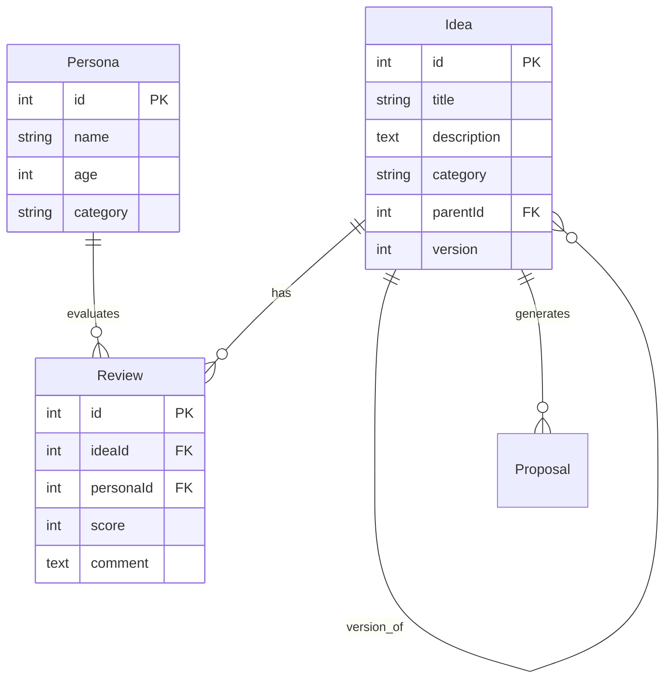
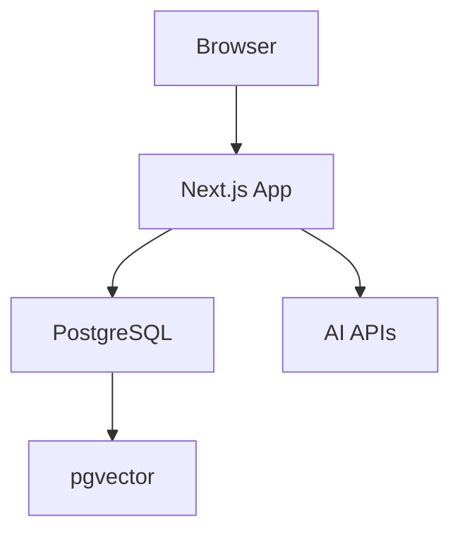

# 設計図

このファイルには、システムの設計図（ER図、アーキテクチャ図、フロー図など）を貼り付けてください。

## データベース設計図（ER図）

### テーブル構成

```
┌─────────────┐
│    Idea     │
├─────────────┤
│ id (PK)     │
│ title       │
│ description │
│ category    │
│ parentId    │──┐
│ version     │  │
└─────────────┘  │
       │         │
       │ 1:N     │ 1:N (自己参照)
       │         │
       ▼         │
┌─────────────┐ │
│   Review    │ │
├─────────────┤ │
│ id (PK)     │ │
│ ideaId (FK) │ │
│ personaId   │ │
│ score       │ │
│ comment     │ │
└─────────────┘ │
       │        │
       │ N:1    │
       ▼        │
┌─────────────┐ │
│  Persona    │ │
├─────────────┤ │
│ id (PK)     │ │
│ name        │ │
│ age         │ │
│ category    │ │
└─────────────┘ │
                │
                │
                ▼
         ┌─────────────┐
         │    Idea     │
         │ (parentId)  │
         └─────────────┘
```

### リレーション詳細

- **Idea ↔ Review**: 1対多（1つのアイデアに複数のレビュー）
- **Persona ↔ Review**: 1対多（1つのペルソナが複数のアイデアを評価）
- **Idea ↔ Idea**: 1対多（自己参照、バージョン管理用）

---

## システムアーキテクチャ図

```
┌─────────────┐
│   Browser   │
└──────┬──────┘
       │
       ▼
┌─────────────────┐
│   Next.js App   │
│  (App Router)   │
├─────────────────┤
│ - Server Actions│
│ - API Routes    │
│ - React Pages   │
└──────┬──────────┘
       │
       ├──────────────┐
       │              │
       ▼              ▼
┌─────────────┐  ┌─────────────┐
│ PostgreSQL  │  │  AI APIs    │
│ + pgvector  │  │ (Claude/    │
│             │  │  OpenAI/    │
│ - Ideas     │  │  Mock)      │
│ - Personas  │  └─────────────┘
│ - Reviews   │
└─────────────┘
```

---

## データフロー図

### アイデア評価フロー

```
[ユーザー]
   │
   ▼
[アイデア作成]
   │
   ▼
[AnalysisJob作成 (PENDING)]
   │
   ▼
[Worker起動]
   │
   ├─→ [90人のペルソナ取得]
   │
   ├─→ [各ペルソナで評価]
   │      │
   │      ├─→ [AI API呼び出し]
   │      │      │
   │      │      ├─→ Claude API
   │      │      ├─→ OpenAI API
   │      │      └─→ Mock (APIキーなし)
   │      │
   │      └─→ [Review保存]
   │
   └─→ [ジョブ完了 (COMPLETED)]
          │
          ▼
      [レポート表示]
```

---

## ペルソナ構成

### カテゴリ別分布

- **Standard_Japan**: 30人（日本の平均的な人口分布）
- **Inbound_Tourist**: 30人（訪日外国人）
- **Biz_Tech**: 30人（ビジネス・テック系）

**合計: 90人**

---

## 技術スタック

### Frontend
- Next.js 16 (App Router)
- React 19
- TypeScript
- Tailwind CSS

### Backend
- Next.js Server Actions
- Next.js API Routes
- Prisma ORM

### Database
- PostgreSQL 15+
- pgvector (ベクトル検索)

### AI Integration
- Anthropic Claude API
- OpenAI API
- Mock Client (APIキー不要)

---

## 設計図をここに貼り付け

以下のセクションに、Mermaid図や画像を貼り付けてください。

### ER図（Mermaid形式）



### アーキテクチャ図（Mermaid形式）



---

## 画像ファイルの配置

画像ファイルは `docs/images/` ディレクトリに配置し、以下のように参照してください：

```markdown


```

