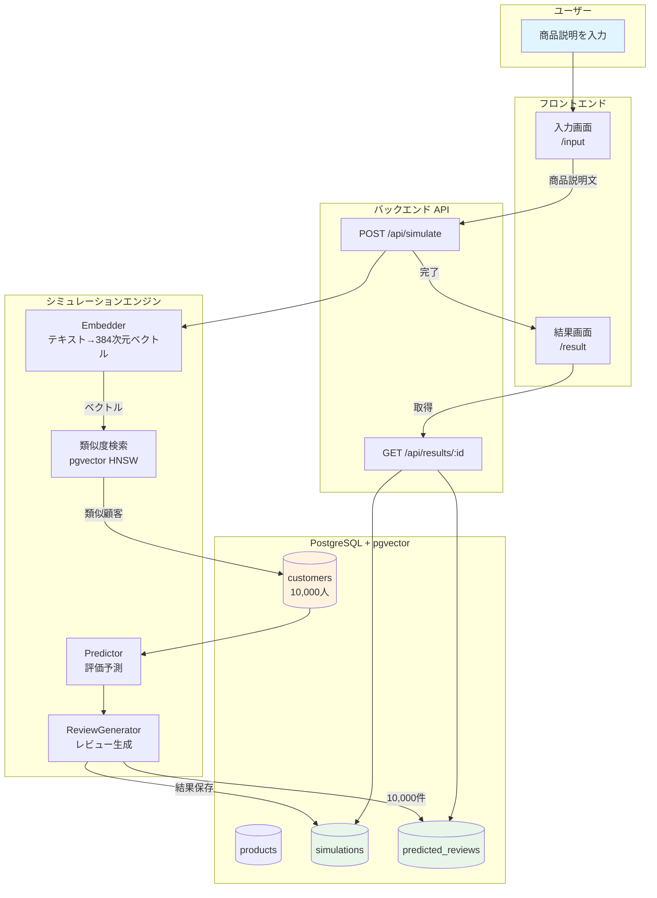
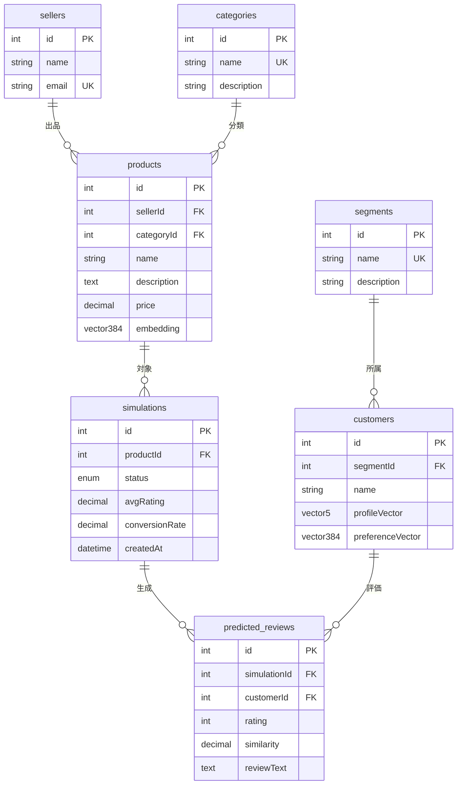
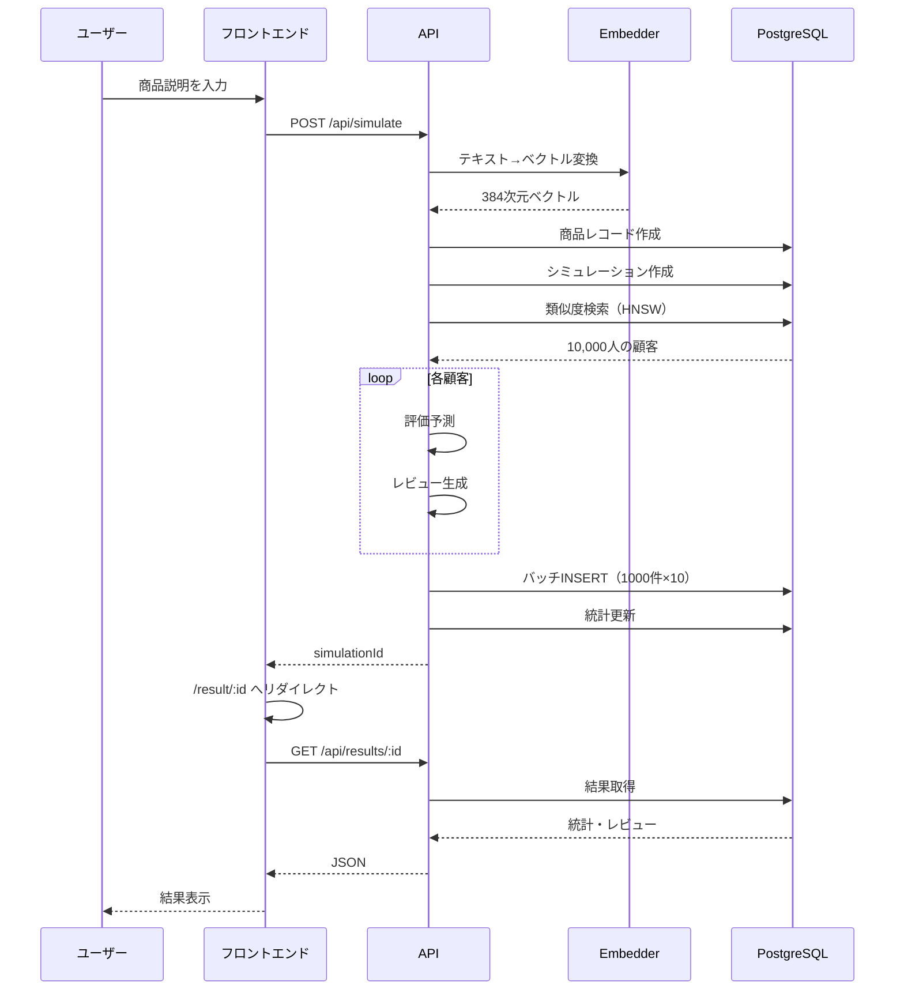

# 図解の生成方法

このフォルダに以下の画像を配置してください。

## 必要な画像

1. **system-overview.png** - システム概要図
2. （必要に応じて追加）

## Mermaidから画像を生成する方法

### 方法1: Mermaid Live Editor（推奨）

1. https://mermaid.live/ にアクセス
2. 下記のMermaidコードを貼り付け
3. 右上の「PNG」または「SVG」ボタンでダウンロード
4. このフォルダに `system-overview.png` として保存

### 方法2: VS Code拡張機能

1. VS Codeに「Mermaid Markdown」拡張をインストール
2. .mdファイル内でプレビュー表示
3. 右クリック→「画像としてエクスポート」

---

## システム概要図のMermaidコード

---

## ER図のMermaidコード

---

## データフローのMermaidコード

